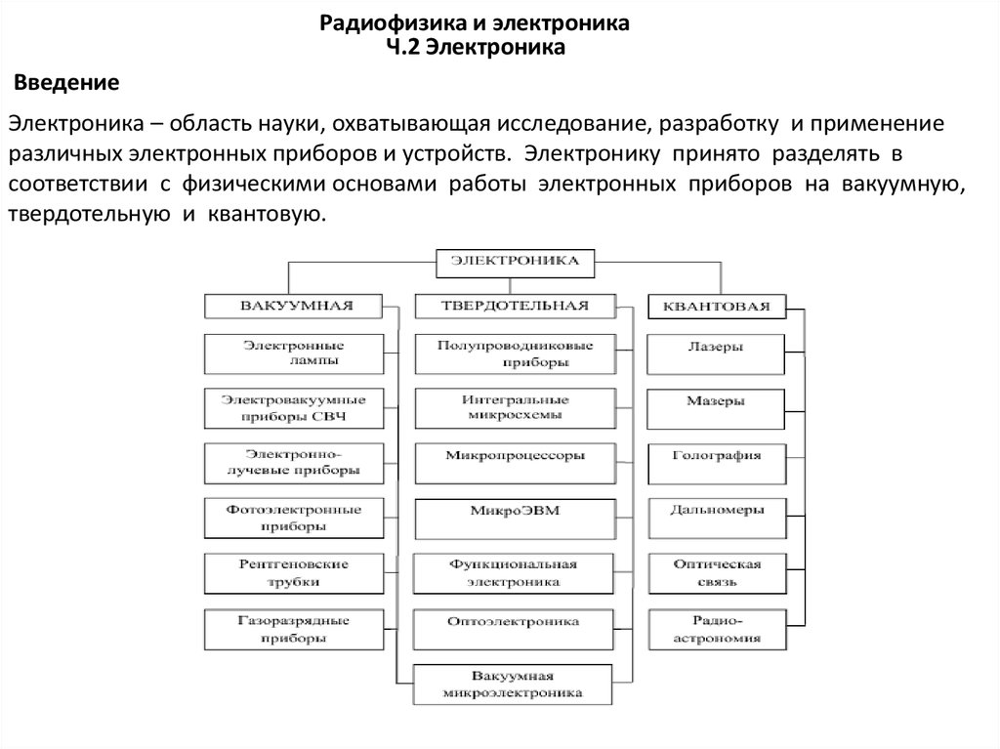

# 1. Электроника: вакуумная, твердотельная, квантовая.

[Назад](EISX.md)

Электроника является разделом физики и техники, изучающим процессы управления, преобразования и передачи энергии при помощи потоков электронов и дырок в различных средах, а также применение этих процессов в различных устройствах и системах. Электроника подразделяется на вакуумную, твердотельную и квантовую, рассмотрим каждую из них подробнее:

1. **Вакуумная электроника**: В вакуумной электронике процессы управления, преобразования и передачи энергии происходят в вакууме, то есть в пространстве, из которого удалены все газы, пыль и другие составляющие. Основным действующим элементом вакуумной электроники являются электронные лампы. Вакуумная электроника заложила основы создания радиолокационных систем, телевидения, радиосвязи и других технических средств. С вакуумной электроникой связано открытие таких явлений, как тепловая и полевая эмиссии, динатронный режим и движение электронов в магнитных и электрических полях.

2. **Твердотельная электроника**: Твердотельная электроника основана на использовании полупроводниковых материалов для создания активных элементов, таких как диоды, транзисторы, тирристоры и др. Преимущества твердотельной электроники перед вакуумной включают компактность, низкое энергопотребление, высокую надежность и большую вариативность применения. Основными направлениями твердотельной электроники являются создание интегральных схем, оптоэлектронных устройств, микроэлектромеханических систем и т.д.

3. **Квантовая электроника**: Квантовая электроника изучает явления и процессы, связанные с использованием квантовых свойств электронов и фотонов, а также их взаимодействия с другими частицами и полями на микроскопическом уровне. Квантовая электроника занимается исследованием и разработкой таких устройств, как лазеры, мазеры, оптические ускорители, квантовые компьютеры и криптографические системы. Особенность квантовой электроники заключается в использовании явлений когерентности, квантовой сверхпроводимости и сверхтонких взаимодействий для преобразования, управления и передачи энергии на молекулярном и атомарном уровнях.

В результате исследования и развития этих трех основных направлений электроники формируются новые технологии и устройства, которые обеспечивают возможность создания современных информационных, телекоммуникационных, оптоэлектронных, медицинских и других технических систем и комплексов, способных выполнять широкий спектр задач с высокой эффективностью, надежностью и безопасностью.

