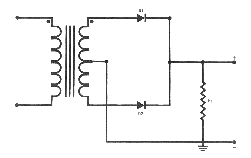
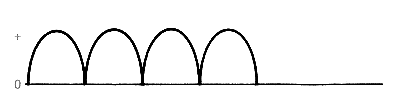

# 11. Схемотехника источников питания. Двухполуперионая схема.

[Назад](EISX.md)

**Двухполупериодный выпрямитель** — устройство или контур, проводящий ток в течение обеих половин цикла переменного тока. Двухполупериодный выпрямитель состоит из трансформатора с центральным отводом вторичной обмотки, двух диодов и сопротивления нагрузки.

