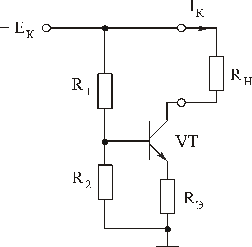

# 13. Схемотехника источников питания. Применение биполярных транзисторов.

[Назад](EISX.md)

Схемотехника источников питания может использовать различные элементы, включая биполярные транзисторы. 

Биполярные транзисторы могут использоваться как ключи в регулируемых источниках питания. Например, транзистор может использоваться для регулирования выходного напряжения путем изменения тока, протекающего через нагрузку. Также, биполярные транзисторы могут использоваться в качестве усилителей в источниках питания для повышения эффективности и точности регулирования. 

Важным параметром биполярных транзисторов в источниках питания является их коэффициент усиления тока (hFE). Выбор транзистора с определенным значением hFE может помочь достичь желаемой точности регулирования выходного напряжения и стабильности работы источника питания. 

Одной из распространенных схем с использованием биполярных транзисторов является схема «Эмиттерный повторитель», в которой транзистор используется как усилитель источника питания для управления нагрузкой. 

_Эмиттерный повторитель_

Другой распространенной схемой является схема «Источник тока», в которой транзистор используется для поддержания постоянного тока через нагрузку, даже при изменении ее сопротивления. 

_Источник тока_

В целом, биполярные транзисторы являются важным элементом в схемотехнике источников питания и могут использоваться в различных конфигурациях для достижения желаемых характеристик источника питания. 
