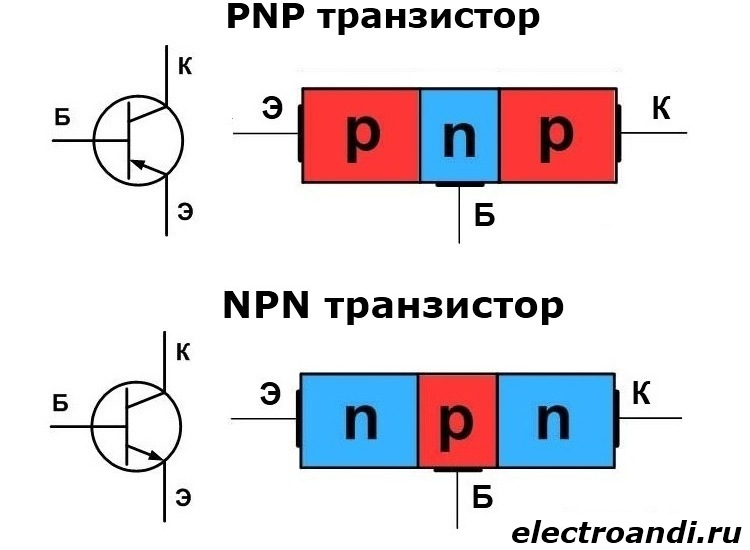
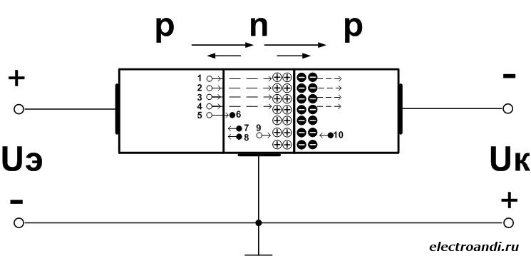
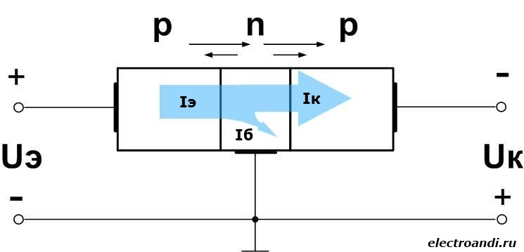

# 14. Биполярные транзисторы. Устройство и принцип действия.

**Биполярный транзистор** представляет собой полупроводниковый элемент, имеющий трехслойную структуру, которая образует два электронно-дырочных перехода. Поэтому транзистор можно представить в виде двух встречно включенных диода. В зависимости от того, что будет являться основными носителями заряда, различают p-n-p и n-p-n транзисторы.

**База** – слой полупроводника, который является основой конструкции транзистора.

**Эмиттером** называется слой полупроводника, функция которого инжектирование носителей заряда в слой базы.

**Коллектором** называется слой полупроводника, функция которого собирать носители заряда прошедшие через базовый слой.

Как правило, эмиттер содержит намного большее количество основных зарядов, чем база. Это основное условие работы транзистора, потому что в этом случае, при прямом смещении эмиттерного перехода, ток будет обуславливаться основными носителями эмиттера. Эмиттер сможет осуществлять свою главную функцию – впрыск носителей в слой базы. Обратный ток эмиттера обычно стараются сделать как можно меньше. Увеличение основных носителей эмиттера достигается с помощью высокой концентрации примеси.

Базу делают как можно более тонкой. Это связано с временем жизни зарядов. Носители зарядов должны пересекать базу и как можно меньше рекомбинировать с основными носителями базы, для того чтобы достигнуть коллектора.

Для того чтобы коллектор мог наиболее полнее собирать носители прошедшие через базу его стараются сделать шире.

## Принцип работы транзистора

Рассмотрим на примере p-n-p транзистора.

В отсутствие внешних напряжений, между слоями устанавливается разность потенциалов. На переходах устанавливаются потенциальные барьеры. Причем, если количество дырок в эмиттере и коллекторе одинаковое, тогда и потенциальные барьеры будут одинаковой ширины.

Для того чтобы транзистор работал правильно, эмиттерный переход должен быть смещен в прямом направлении, а коллекторный в обратном. Это будет соответствовать активному режиму работы транзистора. Для того чтобы осуществить такое подключение, необходимы два источника. Источник с напряжением Uэ подключается положительным полюсом  к эмиттеру, а отрицательным к базе. Источник с напряжением Uк подключается отрицательным полюсом к коллектору, а положительным к базе. Причем Uэ < Uк. 

