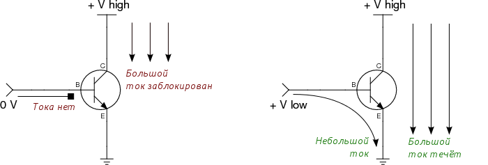
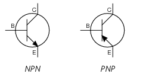

# 15. Биполярные транзисторы.Типы транзисторов: p-n-p, n-p-n. Условное графическое обозначение. Направления токов.

[Назад](EISX.md)

Биполярные транзисторы (BJT, Bipolar Junction Transistors) имеют три контакта:

- **Коллектор (collector)** — на него подаётся высокое напряжение, которым хочется управлять
- **База (base)** — через неё подаётся небольшой ток, чтобы разблокировать большой; база заземляется, чтобы заблокировать его
- **Эмиттер (emitter)** — через него проходит ток с коллектора и базы, когда транзистор «открыт»

Основной характеристикой биполярного транзистора является показатель hfe также известный, как gain. Он отражает во сколько раз больший ток по участку коллектор–эмиттер способен пропустить транзистор по отношению к току база–эмиттер.

Например, если hfe = 100, и через базу проходит 0.1 мА, то транзистор пропустит через себя как максимум 10 мА. Если в этом случае на участке с большим током находится компонент, который потребляет, например 8 мА, ему будет предоставлено 8 мА, а у транзистора останется «запас». Если же имеется компонент, который потребляет 20 мА, ему будут предоставлены только максимальные 10 мА.

Также в документации к каждому транзистору указаны максимально допустимые напряжения и токи на контактах. Превышение этих величин ведёт к избыточному нагреву и сокращению службы, а сильное превышение может привести к разрушению. 

## NPN и PNP

Описанный выше транзистор — это так называемый NPN-транзистор. Называется он так из-за того, что состоит из трёх слоёв кремния, соединённых в порядке: Negative-Positive-Negative. Где negative — это сплав кремния, обладающий избытком отрицательных переносчиков заряда (n-doped), а positive — с избытком положительных (p-doped).

NPN более эффективны и распространены в промышленности.

PNP-транзисторы при обозначении отличаются направлением стрелки. Стрелка всегда указывает от P к N. PNP-транзисторы отличаются «перевёрнутым» поведением: ток не блокируется, когда база заземлена и блокируется, когда через неё идёт ток.
