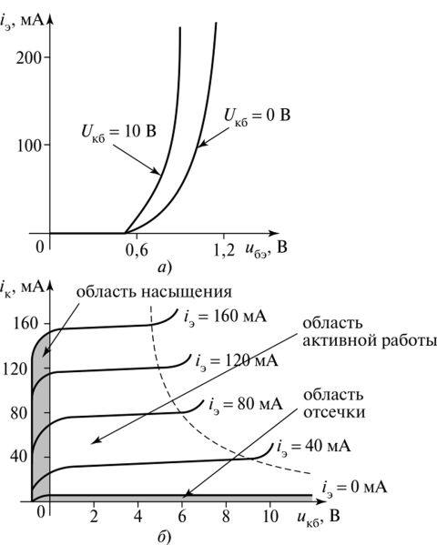

# 17 Биполярные транзисторы. Входная вольт-амперная характеристика. 

[Назад](EISX.md)

**Биполярные транзисторы (БТ)** - это полупроводниковые приборы, которые могут усиливать сигналы и выполнять логические операции в электронных схемах. Они состоят из трех слоев полупроводника - эмиттера, базы и коллектора. 

Входная вольт-амперная характеристика (ВАХ) биполярного транзистора - это график зависимости тока коллектора от напряжения на базе при постоянном напряжении на коллекторе. 

На ВАХ биполярного транзистора можно выделить несколько областей: 

- **Область отсечки (cutoff)** - когда напряжение на базе ниже порогового значения и ток коллектора равен нулю. 
- **Область насыщения (saturation)** - когда напряжение на базе выше порогового значения и ток коллектора максимальный, ограниченный внешней схемой. 
- **Область активного режима (active region)** - когда напряжение на базе выше порогового значения, но ниже насыщения. В этой области изменение тока базы вызывает пропорциональное изменение тока коллектора. 

Входная вольт-амперная характеристика биполярного транзистора имеет S-образную форму, характеризующуюся пороговым напряжением и коэффициентом усиления транзистора. При увеличении напряжения на базе ток коллектора также увеличивается, но с увеличением тока базы коэффициент усиления транзистора уменьшается. 

Таким образом, входная вольт-амперная характеристика биполярного транзистора позволяет определить его параметры и использовать его для усиления и обработки сигналов в электронных устройствах. 
