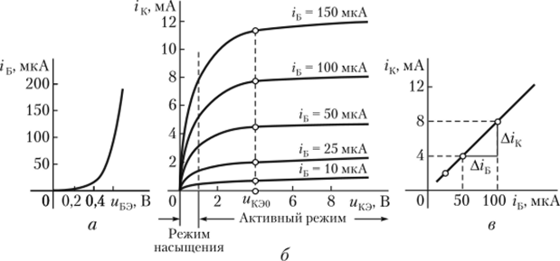

# 18 Биполярные транзисторы. Выходная вольт-амперная характеристика.

[Назад](EISX.md)

**Биполярный транзистор (BJT)** - это электронный прибор, который состоит из трех слоев полупроводникового материала (p-n-p или n-p-n), связанных между собой. Он работает на основе контроля тока, проходящего через его три слоя. 

Выходная вольт-амперная характеристика (ВАХ) биполярного транзистора показывает зависимость коллекторного тока от напряжения между базой и эмиттером. Обычно ВАХ представляют в координатах "коллекторный ток - коллекторное напряжение" при фиксированном токе базы. 

На ВАХ BJT можно выделить две области: активную и насыщения. 

- **Активная область** - это область, в которой BJT работает как усилитель с малым сигналом. В этой области транзистор управляется базовым током, а коллекторный ток пропорционален этому току. ВАХ в активной области имеет нелинейный характер и показывает, что коллекторный ток изменяется по закону квадратичной функции от коллекторного напряжения. 

- **Область насыщения** - это область, в которой BJT работает как ключ. В этой области транзистор насыщен, и коллекторный ток почти не зависит от коллекторного напряжения, а зависит только от тока базы. ВАХ в области насыщения представляет собой почти горизонтальную прямую линию. 

Таким образом, выходная вольт-амперная характеристика BJT демонстрирует основные характеристики этого устройства, позволяющие оценить его работу в качестве усилителя или ключа в электрических цепях.

*[BJT]: Биполярный транзистор 
