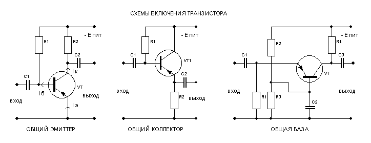

# 19. Биполярные транзисторы. Схема включения - общая база.

[Назад](EISX.md)

Схема включения биполярного транзистора с общей базой - это одна из трех основных схем включения биполярных транзисторов (другие две - с общим эмиттером и общим коллектором). В этой схеме база транзистора является общей точкой для входного и выходного контура.

В схеме с общей базой входной сигнал подается на эмиттер транзистора, а выходной сигнал снимается с коллектора. База транзистора соединена с общим проводом (землей) и обычно имеет небольшое смещение для обеспечения активного режима работы транзистора.

Основные характеристики схемы с общей базой включают низкое входное сопротивление, высокое выходное сопротивление и коэффициент передачи тока (КПТ) близкий к единице. Эта схема обычно используется в качестве усилителя напряжения или буфера с высоким входным и низким выходным сопротивлением.
