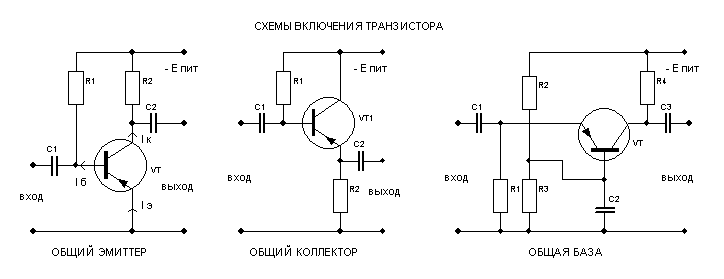

# 20. Биполярные транзисторы. Схема включения - общий эмиттер.

[Назад](EISX.md)

Схема включения с общим эмиттером является наиболее распространенным типом включения биполярных транзисторов. В этой схеме эмиттер транзистора соединяется с общим проводом (землей), а входное напряжение подается на базу, а выходное напряжение снимается с коллектора.

Основные характеристики схемы с общим эмиттером включают высокое входное сопротивление, низкое выходное сопротивление и коэффициент передачи тока (КПТ), который обычно значительно больше единицы. Эта схема обычно используется в качестве усилителя напряжения или тока, а также в качестве ключевых элементов в цифровых схемах.
