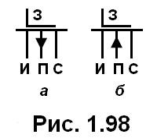

# 26. МОП-транзисторы с индуцированным каналом. Структура. Условное графическое обозначение.

[Назад](EISX.md)

**МОП-транзисторы с индуцированным каналом** (Metal-Oxide-Semiconductor Field-Effect Transistors, MOSFET) являются одним из основных типов полевых транзисторов, используемых в современной микроэлектронике. Они широко применяются в интегральных схемах, таких как микропроцессоры, память и другие цифровые устройства.

Структура МОП-транзистора с индуцированным каналом состоит из следующих основных элементов:

- **Подложка**: Обычно изготовлена из кремния с определенным типом проводимости (p- или n-типа). Подложка служит основой для формирования активных областей транзистора.

- **Исток и сток**: Области с противоположным типом проводимости по отношению к подложке, созданные путем легирования. Они служат для подключения транзистора к внешним цепям.

- **Затвор**: Металлический слой, разделенный от подложки тонким слоем изолятора (оксида кремния). Затвор служит для управления током между истоком и стоком путем изменения напряжения на затворе.

- **Канал**: Область подложки между истоком и стоком, через которую протекает ток при наличии напряжения на затворе. В МОП-транзисторах с индуцированным каналом канал образуется при приложении напряжения на затвор, индуцируя область с противоположным типом проводимости в подложке.

Условное графическое обозначение МОП-транзистора с индуцированным каналом представляет собой символ, состоящий из трех основных частей:

1. Вертикальная линия, представляющая подложку.
2. Горизонтальные линии, исходящие из вертикальной линии, представляющие исток и сток.
3. Зигзагообразная линия, соединенная с вертикальной линией, представляющая затвор.

Дополнительно могут быть указаны стрелки, указывающие тип проводимости подложки (стрелка вверх для p-типа и вниз для n-типа) и круг, обозначающий индуцированный канал.

В зависимости от типа проводимости подложки и канала МОП-транзисторы с индуцированным каналом могут быть классифицированы как n-канальные (nMOS) или p-канальные (pMOS) транзисторы.

*[MOSFET]: Metal-Oxide-Semiconductor Field-Effect Transistors
