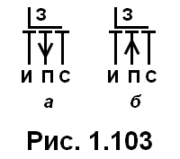

# 28. МОП-транзисторы с встроенным каналом. Структура. Условное графическое обозначение.

[Назад](EISX.md)

МОП-транзисторы со встроенным каналом имеют структуру, аналогичную транзисторам с индуцированным каналом, но с одним ключевым отличием: вместо индуцирования канала при приложении напряжения, канал уже сформирован в подложке в процессе изготовления транзистора. Это достигается за счет создания узкой области с противоположным типом проводимости между исходным и стоковым материалами.

Такие транзисторы также могут быть классифицированы как n-канальные (nMOS) или p-канальные (pMOS) в зависимости от типа проводимости подложки и канала. Однако, из-за наличия встроенного канала, они обычно имеют более низкий пороговый напряжение и меньшую скорость переключения по сравнению с транзисторами с индуцированным каналом.
