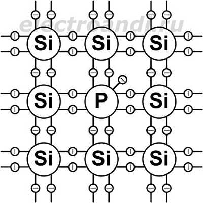
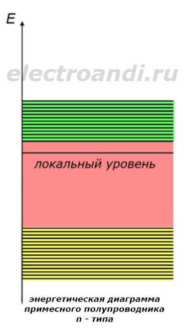
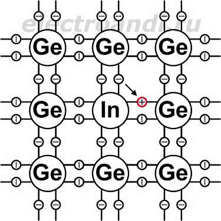
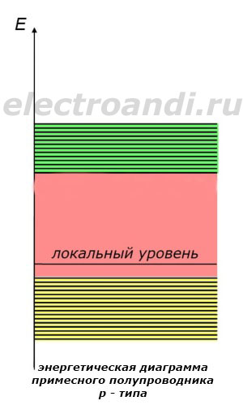

# 3. Полупроводниковые материалы. Легирующие примеси. Электрические характеристики.

[Назад](EISX.md)

В примесных полупроводниках носители заряда создаются благодаря вводимой в кристалл примеси. Это делается для того чтобы создать полупроводник электронной или дырочной проводимости. В полупроводнике электронной проводимости (n- типа) основными носителями заряда являются электроны, а полупроводнике дырочной проводимости (p- типа) – дырки.

## Проводник n- типа

Чтобы создать примесный полупроводник **n – типа**, в кристалл вводят **донорную примесь**. Донорной она называется потому, что добавляет электроны в структуру кристалла. Например, если в кремний ввести атом элемента из 5 группы таблицы Менделеева, то получится избыточный электрон. Это произойдёт потому, что кремний, имеющий 4 валентных электрона, образует ковалентную связь только с 4 электронами фосфора, который имеет 5 валентных электронов. Получается, один электрон окажется слабо соединённым со своим атомом, и достаточно даже небольшого воздействия, чтобы он его покинул и перешёл в зону проводимости. При этом атом примеси становится положительным ионом.

Избыточные электроны на энергетической диаграмме располагаются на так называемых **локальных валентных уровнях**. Эти уровни расположены в запрещенной зоне совсем рядом с зоной проводимости. Для того чтобы попасть в неё, электронам локального уровня необходимо получить около **0,1 эВ**. Выходит, что в зоне проводимости оказываются в основном электроны созданные примесью, так как им легче перейти в неё, чем тем электронам, который находятся в валентной зоне и которым необходимо перейти всю запрещенную зону. Поэтому электронов оказывается во много раз больше чем дырок, и они являются **основными** носителями, а дырки **неосновными**.

## Проводник p- типа

Чтобы создать полупроводник **p- типа**, в кристалл вводится **акцепторная примесь**. Например, если ввести в кристалл германия атом индия, то в результате получится положительный нескомпенсированный заряд. Это произойдёт потому, что германий имеет 4 валентных электрона, а индий 3. Индий образует ковалентную связь с тремя ближайшими атомами германия, а одна связь будет разрушена и на её месте останется дырка. При незначительном увеличении температуры соседние электроны займут эту дырку, но тем сам они оставят её в другом месте. Таким образом, получится движение положительного заряда. На рисунке показано, где может располагаться дырка в примесном атоме и электрон, который с увеличением температуры займет её место.

На энергетической диаграмме, дырки акцепторной примеси создают локальные валентные уровни в запрещенной зоне, вблизи валентной зоны. Энергия, которая требуется для перехода электронам на локальные уровни, крайне мала, поэтому при воздействии температуры, все они оказываются заполненными электронами, перешедшими из валентной зоны. В связи с этим, в валентной зоне повышается концентрация дырок, вызванная акцепторной примесью. Следовательно, основными носителями заряда в полупроводнике являются дырки, образованные примесью, а электроны являются неосновными носителями.

Концентрация носителей заряда зависит от температуры. При самых низких температурах, в зону проводимости начинают проходить электроны примеси. Это продолжается до некоторого значения, пока все электроны не перейдут. Затем с дальнейшим ростом температуры начинает происходить процесс термогенерации и образовываться новые электроны и дырки. В конечном итоге может стать так, что количество дырок будет примерно соответствовать количеству электронов, другими словами произойдет **вырождение полупроводника**.
