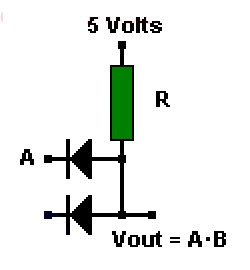
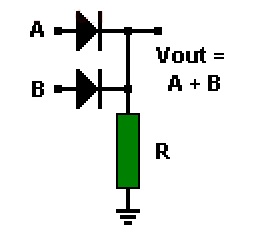

33. Схемотехника цифровых систем. Устройство логических элементов на диодах.

[Назад](EISX.md)

**Схемотехника цифровых систем** - это раздел электроники, изучающий принципы построения и функционирования цифровых устройств и систем на основе логических элементов.

**Логические элементы на диодах** - это простейшие цифровые устройства, которые реализуют основные логические функции, такие как И, ИЛИ и НЕ. Они состоят из диодов и резисторов, соединенных определенным образом, и используются для обработки и передачи цифровых сигналов.

## Устройство логического элемента "И" на диодах:

В этой схеме используются два диода и один резистор. Оба диода соединены анодами к входам схемы, а катоды диодов соединены между собой и с одним концом резистора. Другой конец резистора подключается к питанию. Выход схемы берется с общей точки соединения катодов диодов и резистора. Если на оба входа подается высокий уровень сигнала, оба диода открываются, и на выходе схемы формируется высокий уровень сигнала. В противном случае, на выходе будет низкий уровень сигнала.

## Устройство логического элемента "ИЛИ" на диодах:

В этой схеме также используются два диода и один резистор. Аноды диодов соединены с входами схемы, а катоды диодов соединены между собой и с одним концом резистора. Другой конец резистора подключается к земле. Выход схемы берется с общей точки соединения катодов диодов и резистора. Если на один из входов подается высокий уровень сигнала, соответствующий диод открывается, и на выходе схемы формируется высокий уровень сигнала. Если на оба входа подается низкий уровень сигнала, оба диода закрыты, и на выходе схемы формируется низкий уровень сигнала.

## Устройство инвертора (логического элемента "НЕ") на диодах:

В этой схеме используется один диод и два резистора. Анод диода соединяется с входом схемы, а катод - с одним концом первого резистора. Другой конец первого резистора подключается к питанию. Второй резистор соединяется параллельно диоду, один конец подключается к входу схемы, а другой - к выходу схемы и к первому резистору. Если на вход подается высокий уровень сигнала, диод открывается, и на выходе схемы формируется низкий уровень сигнала. Если на вход подается низкий уровень сигнала, диод закрыт, и на выходе схемы формируется высокий уровень сигнала.

Логические элементы на диодах являются простыми и недорогими, однако они имеют ряд недостатков, таких как низкая скорость работы и большое падение напряжения на диодах. В современных цифровых системах чаще используются более сложные и быстродействующие логические элементы на транзисторах и интегральных схемах.
