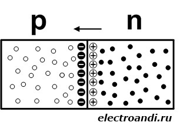

# 4. Полупроводниковые материалы. Принцип работы p-n перехода. Потенциальный барьер.

[Назад](EISX.md)

**Электронно-дырочный переход (ЭДП)** - это область, которая разделяет поверхности электронной и дырочной проводимости в монокристалле.

Электронно-дырочный переход изготавливают в едином монокристалле, в котором получена достаточно резкая граница между областями электронной и дырочной проводимостей.

На рисунке изображены две граничащие области полупроводника, одна из которых содержит **донорную примесь** (область электронной, то есть n-проводимости), а другая **акцепторную примесь** (область дырочной проводимости, то есть p-проводимости).

При отсутствии приложенного напряжения наблюдается диффузия основных носителей зарядов из одной области в другую. Так как **электроны** это основные носители заряда, и в области n их концентрация больше они диффундируют в p-область заряжая отрицательно приграничный слой этой области. Но уходя со своего места электроны создают вакантные места – **дырки**, тем самым заряжая приграничный слой n-области положительно. Таким образом, через достаточно короткий промежуток времени с обеих сторон поверхности раздела образуются противоположные по знаку пространственные заряды.

Электрическое поле, создаваемое пространственными зарядами, препятствует дальнейшей диффузии дырок и электронов. Возникает так называемый **потенциальный барьер**, высота которого характеризуется разностью потенциалов в пограничном слое.

Электронно-дырочный переход, во внешнем исполнении реализуется в виде **полупроводникового диода**.
