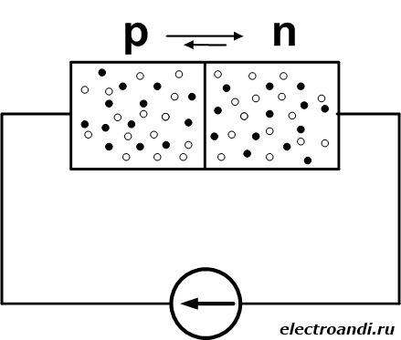
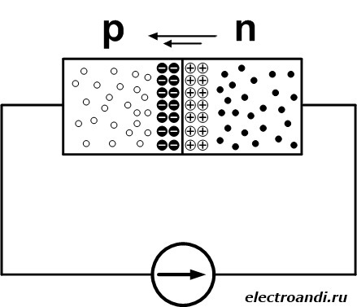
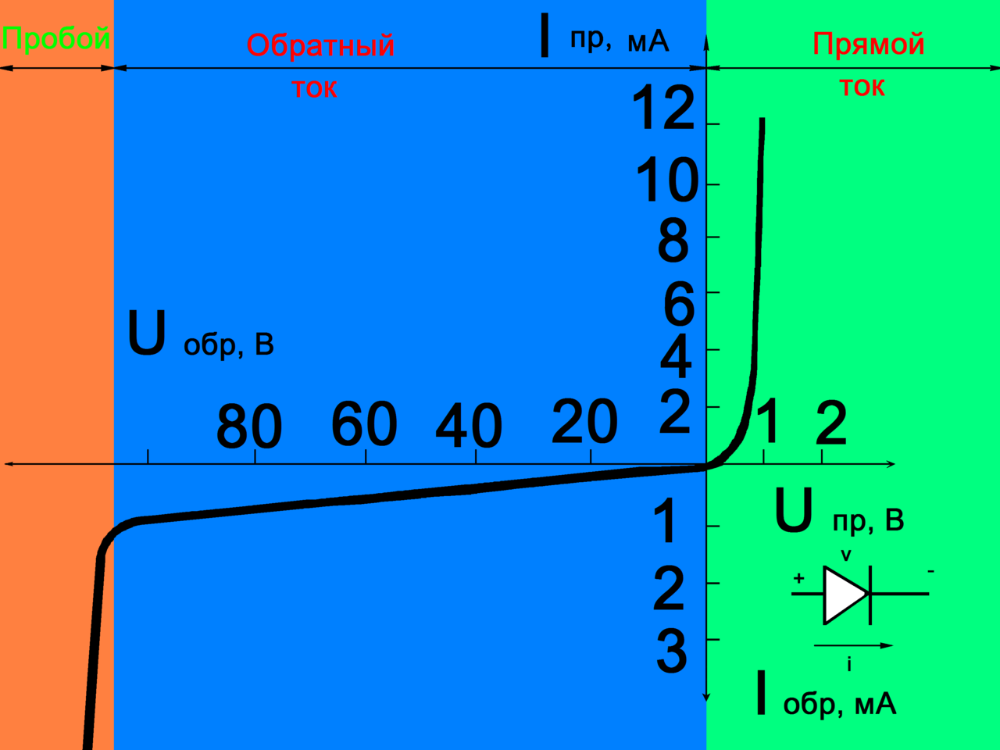

# 5. Полупроводниковые диоды. Принцип работы. Вольт-амперная характеристика.

Электронно-дырочный переход, во внешнем исполнении реализуется в виде **полупроводникового диода**.

Если к электронно-дырочному переходу приложить внешнее напряжение так, что к области с электронной проводимостью подключён отрицательный полюс источника, а к области с дырочной проводимостью – положительный, то направление напряжения внешнего источника будет противоположно по знаку электрическому полю p-n перехода, это вызовет увеличение тока через p-n переход. Возникнет **прямой ток**, который будет вызван движение основных носителей зарядов, в нашем случае это движение дырок из p области в n, и движение электронов из n области в p. Следует знать, что дырки движутся противоположно движению электронов, поэтому на самом деле, ток течет в одну сторону. Такое подключение называют **прямым**. На вольт-амперной характеристике такому подключению будет соответствовать часть графика в первом квандранте.

Но если изменить полярность приложенного к p-n переходу напряжения на противоположное, то электроны из пограничного слоя начнут движение от границы раздела к положительному полюсу источника, а дырки к отрицательному. Следовательно, свободные электроны и дырки будут отдаляться от пограничного слоя, создавая тем самым прослойку, в которой практически отсутствуют носители зарядов. В результате ток в p-n переходе снижается в десятки тысяч раз, его можно считать приближённо равным нулю. Возникает **обратный ток**, который образован не основными носителями заряда.Такое подключение называют **обратным**. На вольт-амперной характеристике такому подключению будет соответствовать часть графика в третьем квандранте. 

## Вольт-амперная характеристика

При прямом подключении электронно-дырочного перехода, ток возрастает с увеличением напряжения. При обратном подключении ток достигает значения **Iнас**, называемое **током насыщения**. Если продолжать увеличивать напряжение при обратном включении, то может настать пробой диода. Это свойство также используется в различных стабилитронах и т.д.

Свойства p-n перехода широко применяются в электронике, а именно в диодах, транзисторах и других полупроводниках.
