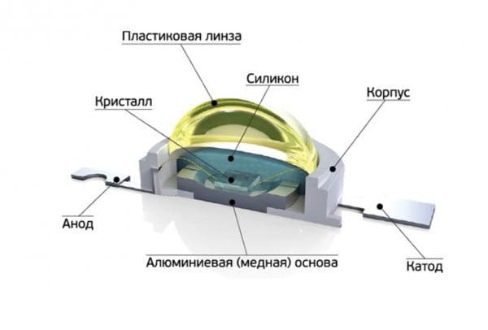

# 7. Светодиоды. Принцип работы. Вольт-амперная характеристика.

[Назад](EISX.md)

**Светодиод** - это полупроводниковый прибор, преобразующий электрический ток непосредственно в световое излучение.

Это световое устройство в пластиковом литом корпусе (разного цвета) с двумя выводами со впаянным кристаллом. 

Корпус выполняет две функции – является линзой и защитным покрытием. Питание светодиода обеспечивается током. Яркость свечения пропорциональна напряжению.

## Принцип работы

Светодиод состоит из следующих частей: 
- основание; 
- линза; 
- катод (-); 
- анод (+); 
- кристалл (полупроводниковый чип); 
- отражатель (рассеиватель). 

В основании закреплены катод и анод, сверху все устройство герметично закрыто линзой (колбой). На катоде закреплен кристалл. На контактах установлены проводники, подсоединенные к кристаллу p-n-переходом (соединительная проволока, объединяющая два проводника с разными типами проводимости).

**Анод (p типа)** является положительным электродом, **катод (n типа)** это отрицательный электрод. Внешняя поверхность катода и анода содержит контактные металлические площадки с припаянными выводами. Когда к аноду подается положительный заряд электричества, а к катоду отрицательный, то на р-n переходе между кристаллом катодом начинает течь ток.

Если включение **прямое**, то электроны из n и области и дырки из p-области устремятся навстречу друг другу. В процессе легирования (обмена электронами) на границе дырочно – электронного перехода произойдет их обмен. Если отрицательное напряжение подается со стороны материала n-типа, то происходит прямое смещение. При рекомбинации (обмене) выделяется энергия в виде фотонов.

Чтобы поток фотонов преобразовать в видимый свет, материал подбирают так, что длина волны фотонов находится в пределах видимой области цветового спектра длиной волны от 400 до 700 нм.
