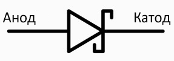
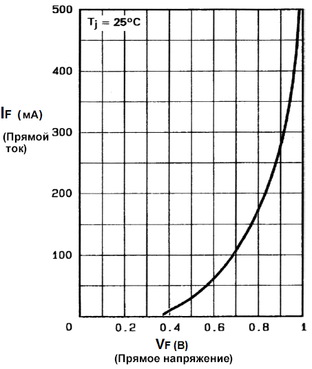
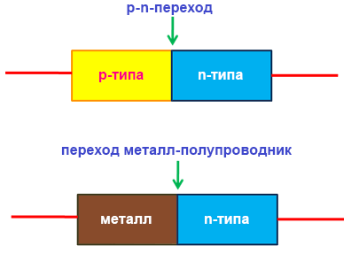
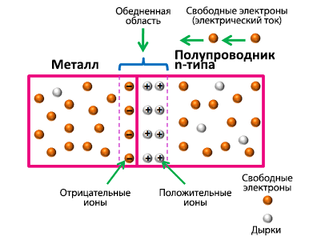
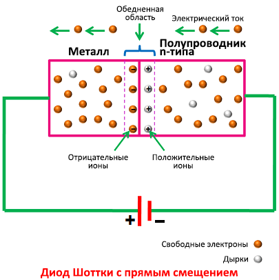
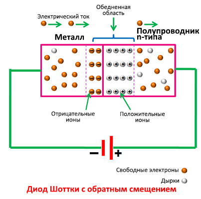

# 8. Диоды Шоттки. Принцип работы. Вольт-амперная характеристика.

Подобно другим диодам, диод Шоттки в зависимости от направления течения тока в электрической цепи влияет на ток. В мире электроники эти устройства работают так же, как улицы с односторонним движением – они позволяют току течь только от анода к катоду. Тем не менее, в отличие от обычных полупроводниковых диодов, диод Шоттки известен благодаря низкому падению напряжения при его прямом включении и способностью к быстрому переключению. Это делает его идеальным выбором для использования в высокочастотных устройствах, а также в устройствах, где используются низкие напряжения. Диод Шоттки может применяться в самых разных устройствах, например:

- **Для выпрямления тока большой мощности**. Диоды Шоттки могут использоваться в мощных устройствах благодаря низкому падению напряжения при прямом включении. Эти диоды затрачивают меньше энергии, что способствует уменьшению размеров радиатора;

- **В универсальных источниках питания**. Диоды Шоттки также могут помогать разделять питание при использовании блоков двойного электропитания, использующих энергию электрической сети и аккумуляторов;

- **В элементах солнечных батарей**. Диоды Шоттки могут помочь добиться максимальной эффективности элементов солнечной батареи благодаря низкому падению напряжения при прямом включении. Также они помогают защищать ячейки от обратного заряда;

- **В качестве защелки**. Диоды Шоттки могут также использоваться в качестве защелки в транзисторных схемах, а также в цепях с логическими элементами 74LS или 74S.

## Преимущества и недостатки диода Шоттки

Одним из главных преимуществ использования диода Шоттки вместо обычного диода является низкое сопротивление его перехода металл-полупроводник, приводящее к тому, что напряжение падает при его прямом включении. Таким образом диод Шоттки потребляет меньшее напряжение, чем обычный диод. На его p-n-переходе падает лишь 0,3-0,4 В. На графике ниже вы можете видеть прямое падение напряжение, составляющее приблизительно 0,3 В. Ток через диод Шоттки значительно возрастает при увеличении напряжения сверх указанного. Через обычный диод ток не растет до напряжения приблизительно 0,6 В.

## Принцип работы

В обычном диоде полупроводники p-типа и n-типа образуют p-n-переход. В диоде Шоттки вместо полупроводника p-типа используется металл. Этот металл может быть разным – от платины до вольфрама, молибден, золото и т. д.

Металл и полупроводник n-типа образуют переход металл-полупроводник. Он называется барьером Шоттки. Свойства барьера Шоттки различны при отсутствии напряжения смещения, при прямом и при обратном смещении.

### Напряжение смещения отсутствует

При отсутствии напряжения смещения свободные электроны будут перемещаться из полупроводника n-типа в металл, чтобы восстановить равновесие. Этот поток электронов создает барьер Шоттки, где встречаются отрицательные и положительные ионы. Чтобы свободные электроны смогли преодолеть этот барьер, требуется приложение внешнего напряжения большего, чем потенциал поля перехода металл-полупроводник.

### Прямое смещение 

Если положительную клемму батарейки подключить к выводу диода, подключенного к металлической части перехода метал-полупроводник, а отрицательную – к выводу диода, подключенного к полупроводнику, то таким образом мы подадим на диод прямое смещение. В этом состоянии, если напряжение больше 0,2 В, то электроны могут преодолеть переход металл-полупроводник и перейти из полупроводника n-типа в металл. Это приведет к возникновению тока через диод. Так работают все диоды.

### Обратное смещение

Если отрицательную клемму батарейки подключить к выводу диода, подключенного к металлической части перехода метал-полупроводник, а положительную – к выводу диода, подключенного к полупроводнику, то таким образом мы подадим на диод обратное смещение. Так мы увеличим ширину барьера Шоттки, не давая току течь через диод. Тем не менее, если напряжение обратного смещения будет возрастать, то, в конце концов, барьер будет пробит. После чего ток потечет в обратном направлении и может повредить этот и другие электронные компоненты.

