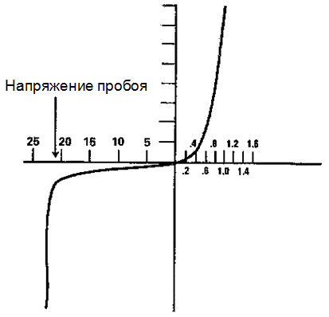

# 9. Стабилитроны. Принцип работы. Вольт-амперная характеристика.

[Назад](EISX.md)

**Стабилитрон** — специальный диод, который способен работать в условиях обратного смещения в зоне пробоя без какого-либо ущерба для себя.

## Принцип действия стабилитрона

График напряжение-ток для стабилитрона похож на график напряжение-ток для P-N перехода обычного диода.

Когда стабилитрон имеет прямое смещение, то, также, как и в любом обычном диоде, ток, проходящий через него, возрастает при увеличении подаваемого напряжения. Когда же стабилитрон имеет обратное смещение, то ток бывает минимальным до того момента, пока подаваемое напряжение не достигнет значения напряжения пробоя для данного диода. Когда такое напряжение достигается, то происходит значительное увеличение протекающего тока. Однако, в отличие от обычного диода, стабилитрон предназначен для работы в условиях обратного смещения в зоне пробоя.

## Напряжение стабилитрона

Необходимое напряжение стабилитрона — это то напряжение, при котором происходит пробой. В процессе изготовления стабилитрона, к основным исходным материалам добавляют определенное количество других материалов, присадок, так что во время работы данного прибора пробой происходит при совершенно конкретном значении напряжения.

Если подаваемое на стабилитрон напряжение превышает установленное для него напряжение пробоя на достаточно большую величину, то тепло, которое сопровождает прохождение через стабилитрон чрезмерного тока, может вызывать серьезные повреждения. Для того, чтобы предотвратить подобные неприятности, цепи со стабилитроном обычно имеют установленный последовательно резистор, который должен ограничивать величину тока, протекающего через стабилитрон. Если выбрано правильное значение сопротивления, то ток в цепи не будет превышать максимальное значение тока для стабилитрона.

Если же подаваемое напряжение меньше, того, на которое рассчитан стабилитрон, то сопротивление протеканию тока будет значительным и этот диод будет оставаться в основном в разомкнутом состоянии, однако, когда подаваемое напряжение станет равно или превысит расчетное напряжение стабилитрона, то сопротивление тока окажется преодоленным, и ток потечет через стабилитрон и по цепи.
