# Методы обработки изображений

[Назад](../README.md)

## 1. Способы формирования изображений

Существует два основных способа представления графических изображений - при помощи растра и векторный.

### Растровая графика

Растровое изображение строится из отдельных точек (пикселей), каждая из которых имеет определенное положение и цвет. Изображение описывается конкретным расположением и цветом каждой точки в растровом изображении не существует объектов как таковых (линий, фигур и т. д.).

В памяти компьютера растровое изображение представлено набором кодов: координаты точки (или номер) и код цвета. Если изображение состоит только из черных и белых точек, то для хранения цвета одной точки требуется 1 бит. Чем больше цветов, тем больше бит требуется для хранения цветовой характеристики каждой точки, тем больше будет объем файла с таким изображением.

Растровое изображение характеризуется разрешением (количеством пикселей в изображении) и глубиной цвета (количеством цветов). На качество растрового изображения оказывает существенное влияние то устройство, с помощью которого его просматривают (монитор или принтер). Вывод растровой графики на устройства с более низким разрешением, чем разрешение самого изображения, понизит его качество.
Масштабирование растрового изображения

При изменении размеров изображения (масштабировании), качество изображения ухудшается. При уменьшении несколько соседних точек преобразуются в одну, поэтому исчезают мелкие детали. При увеличении - увеличивается размер каждой точки, картинка превращается в набор цветных квадратиков.

Растровые изображения могут быть получены при сканировании, фотографировании и видеосъемки при помощи цифровых аппаратов и камер.

Достоинства:

- Растровые изображения очень хорошо передают реальные образы. Они замечательно подходят для фотографий, картин и в других случаях, когда требуется максимальная «естественность».
- Легко выводятся на монитор или принтер, поскольку эти устройства тоже основаны на растровом принципе формирования изображения.

Недостатки:

- Большой объем, необходимый для хранения изображения. Растровое изображение высокого качества может занимать сотни мегабайт памяти. Для обработки их нужны мощные компьютеры.
- Плохая масштабируемость. Любое изменение размеров неизбежно приводит к ухудшению качества: при увеличении пиксели не могут появиться «из ничего», при уменьшении часть пикселов просто выбрасывается.

### Векторная графика

Векторное изображение формируется из объектов (точка, линия, окружность, прямоугольник, кривая и т. д.), называемых примитивами. При этом сохраняется не сам рисунок, а правила его построения. Например, для построения круга сохраняются не все пиксели круга, а команда «построить круг радиусом 30 с центром в точке (50,135) и закрасить его красным цветом». Точка задается своими координатами, кривая — координатами начала и конца и уравнением. Поэтому файлы, хранящие векторные изображения, имеют сравнительно небольшой объем.

При редактировании элементов векторного изображения изменяются параметры линий, задающих форму этих элементов. Можно переносить элементы, менять их форму и цвет, но это не отразится на качестве их визуального представления. В векторном изображении все части (примитивы) могут быть изменены независимо друг от друга. Любой из них можно увеличить, повернуть, деформировать, перекрасить и даже стереть — остальных объектов это не изменит.

Векторная графика не зависит от разрешения, то есть может быть показана в разнообразных устройствах вывода с различным расширением без потери качества, так как изображение пересчитывается в растровое представление для данного устройства непосредственно перед выводом на устройство.

Достоинства:

- Небольшой объем файла, хранящего векторное изображение.
- Объекты векторной графики легко трансформируются, ими легко манипулировать, что не влияет на качество изображения.
- Качественное представление изображения на любом устройстве вывода.

Недостаток: 
- не предоставляет возможность для создания фотореалистических изображений.

## 2. Математический аппарат, применяемый в цифровой обработке изображений
Изображение можно определить как двухмерную функцию f(x, y), где х и у — это
пространственные (плоскостные) координаты, а амплитуда / для каждой пары координат
(x, у) называется интенсивностью или яркостью изображения в точке с этими
координатами. Словосочетание уровень серого часто используется для обозначения
яркости монохромного изображения. Цветные изображения формируются комбинацией
нескольких монохромных изображений. Например, в цветовой системе RGB цветное
изображение строится из трех отдельных монохромных компонент (красной, зеленой и
синей). По этой причине многие методы и приемы, разработанные для монохромных
изображений, могут быть распространены на цветные изображения путем
последовательной обработки трех монохромных компонент. Изображение может иметь
непрерывные х- и у-координаты, а также непрерывную амплитуду. Преобразование такого
изображения в цифровую форму требует представления координат и значений амплитуды
некоторыми дискретными отсчетами. Представление координат конечным множеством
отсчетов называется дискретизацией, а представление амплитуды значениями из
конечного набора называется квантованием. Таким образом, если координаты x, y, а также
величины амплитуды f выбираются из фиксированных конечных наборов элементов
(дискретных величин). то изображение называется цифровым изображением.

Результатом дискретизации и квантования изображения является матрица чисел. В
курсе дисциплины используются два основных метода для представления цифровых
изображений. Предположим, что изображение f(x, y) после дискретизации представлено в
виде матрицы, у которой имеется М строк и N столбцов. Тогда говорят, что изображение
имеет размер М х N. Значения координат (х, у) являются дискретными величинами. Для
удобства и ясности значения этих дискретных координат принимаются целочисленными.
Во многих книгах по обработке изображений за начало координат принимается верхний
левый угол изображения, координатами которого служит пара (х, у) = (0,0). Следующая
точка в первой строке изображения имеет координаты (х, у) = (0,1). Важно помнить, что
пара (0,1) относится ко второму пикселу (элементу изображения) вдоль первой строки
изображения. Это, однако, не обозначает настоящие физические координаты при
регистрации соответствующего изображения. На рис. 1, а) показано это координатное
4
соглашение. Заметим, что координата х меняется от 0 до М — 1 с шагом 1, а координата у
меняется от 0 до N — 1 с шагом 1.
Координатное соглашение, используемое в пакете IPT для обозначения массивов,
отличается от описанного выше в некоторых деталях. Во-первых, вместо (х, у)
используется пара (r, с) для обозначения номеров строк и столбцов. Отметим, что порядок
координат имеет тот же смысл, что и в предыдущем абзаце, т. е. первая координата
соответствует строке, вторая — столбцу. Другое отличие состоит в том, что начало
координат расположено в точке (r, с) — (1,1), т.е. переменная r меняется от 1 до М, а с —
от 1 до N с шагом 1. На рис. 1, б) проиллюстрировано это координатное соглашение. В
документации пакета IPT соглашение из рис. 1, б) называется координатами пикселов.

## 3. Основы яркостных преобразований изображений

### Основные функции градационных преобразований:

- Преобразование изображения в негатив.
- Логарифмические преобразования.
- Степенные преобразования.

Преобразование изображения в негатив подходит для усиления белых или серых деталей на фоне
темных областей изображения, особенно когда темные области имеют преобладающие
размеры.

Логарифмические преобразования отображают узкий диапазон малых значений яркостей
на исходном изображении в более широкий диапазон выходных значений. Для больших
значений входного сигнала верно обратное утверждение.

### Эквализация гистограммы 
Эквализацией или линеаризацией гистограммы цифрового изображения называется 
такое преобразование исходного изображения, при котором гистограмма эквализованного 
изображения перекрывает более широкий диапазон уровней яркости, чем гистограмма 
исходного изображения.

Таким образом, суть метода эквализации гистограммы заключается в нахождении
функции преобразования, которая стремится сформировать выходное изображение с
равномерной гистограммой. 

Эквализация гистограммы изображения приводит к существенному усилению контраста. 
К достоинствам метода относится простота его реализации и предсказуемость 
получаемых результатов.

Тем не менее, в некоторых случаях улучшение изображения, основанное на модели
равномерной гистограммы, не является наилучшим подходом. Иногда необходимо
задавать желаемую форму гистограммы для обрабатываемого изображения. Метод,
позволяющий получить обработанное изображение с заданной формой гистограммы,
называется методом приведения или задания гистограммы. Данный метод представляет
собой итеративную процедуру, заключающуюся в подборе оптимальной формы
гистограммы.

## 4. Использование гистограмм при обработке изображений

## 5. Основы пространственной фильтрации изображений

Как уже было показано ранее, окрестностная обработка изображений состоит из 
следующих действий:

1. определение центральной точки (х, у);
2. совершение операции, которая использует лишь значения пикселов в заранее 
оговоренной окрестности вокруг центральной точки;
3. назначение результата этой операции «откликом» совершаемого процесса в этой точке;
4. повторение всего процесса для каждой точки изображения.

В результате перемещения центральной точки образуются новые окрестности, отвечающие 
каждому пикселу изображения. Для описанной процедуры принято использовать термины
окрестностная обработка и пространственная фильтрация, причем последний является более 
употребимым. Если операции, совершаемые над пикселами окрестности, являются линейными, 
то вся процедура называется линейной пространственной фильтрацией (также иногда
используется термин пространственная свертка), в противном случае она называется нелинейной 
пространственной фильтрацией.
Понятие линейной фильтрации тесно связано с преобразованием Фурье при обработке
сигналов в частотной области.

Операции линейной пространственной фильтрации состоят из умножения каждого пиксела 
окрестности на соответствующий коэффициент и суммирование этих произведений для
получения результирующего отклика процесса в каждой точке (х, у). Если окрестность имеет
размер т х п, то потребуется тп коэффициентов. Эти коэффициенты сгруппированы в виде
матрицы, которая называется фильтром, маской, фильтрующей маской, ядром, шаблоном или
окном, причем первые три термина являются наиболее распространенными. По причинам, 
которые скоро станут известны, мы также будем использовать термины сверто ный фильтр,
маска или ядро.

Механизм линейной пространственной фильтрации проиллюстрирован на рис. 12. Про-
цесс заключается в перемещении центра фильтрующей маски w от точки к точке изображения f.
В каждой точке (х, у) откликом фильтра является сумма произведений коэффициентов фильтра
и соответствующих пикселов окрестности, которые накрываются фильтрующей маской. Для
маски размера т х п обычно предполагается, что m = 2а + 1 и n = 2b + 1, где а и 
b — неотрицательные целые числа, т. е. основное внимание уделяется маскам, имеющим нечетные размеры,
причем наименьшим содержательным размером маски считается размер 3x3 (маска 1x1 исключается 
как тривиальная). Преимущественное обращение с масками нечетных размеров является
вполне обоснованным, поскольку в этом случае у маски имеется выраженная центральная точка.

Увеличенный рисунок показывает маску 3x3 и соответствующий фрагмент изображения
под ней, который несколько смещен для удобства прочтения формул.
Имеется две тесно связанные концепции, которые необходимо хорошо понимать при 
совершении линейной пространственной фильтрации. Первая — это корреляция, а вторая —
свертка. С точки зрения механики процесса, свертка делается так же, но маску w надо повернуть на
180° перед прохождением по изображению f. Две эти концепции лучше всего объяснить на простых примерах.

## 6. Сглаживающие пространственные фильтры

Одной из наиболее распространенных задач в улучшении изображений является задача удаления шумов. 
Шумы на изображениях содержатся, в основном, в высокочастотных компонентах и наиболее логичной 
представляется фильтрация в частотной области, которая будет рассмотрена далее. Однако возможна 
реализация сглаживающих фильтров и в пространственной области.

Другой задачей, для решения которой применяются сглаживающие фильтры является задача расфокусировки 
изображения. Она может применяться как самостоятельно, так и как предварительный этап для других методов.

Наиболее простым вариантом сглаживающего пространственного фильтра является линейный сглаживающий фильтр, 
также называющийся усредняющим. Из его названия очевидно, что усредняющий фильтр использует в качестве 
результирующего значения интенсивности ее среднее значение по используемой окрестности. Усреднение значений 
приводит к сглаживанию резких переходов изображения, к которым относятся и шумы. Однако необходимо помнить, 
что контуры объектов на изображениях также описываются в большей степени высокочастотными компонентами, а 
значит, после обработки таким фильтром, они тоже будут сглажены.

С учетом того, что сумма всех коэффициентов маски должна равняться единице, для окрестности 3x3 маска 
простейшего усредняющего фильтра будет иметь следующий вид:

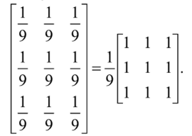

Фильтр с такой маской называют однородным сглаживающим фильтром. Довольно очевидно, что такой фильтр очень сильно размывает изображение, а потому он применяется на практике относительно редко.

Другим вариантом линейного сглаживающего фильтра является взвешенный сглаживающий фильтр. Коэффициенты маски такого фильтра имеют различные значения в зависимости от их положения, например эти значения могут соответствовать распределению Гаусса. Маска такого фильтра может иметь следующий вид:

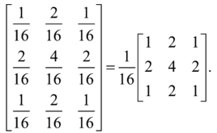

Фильтры с масками такого вида являются более интересными и более гибкими.

Можно заметить, что коэффициенты масок усредняющих фильтров являются дробными числами, что не всегда удобно и рационально при компьютерной реализации. В связи с этим нормирующий коэффициент зачастую выносится из маски и нормировка производится уже после операции свертки. Таким образом, фильтрация производится по формуле:

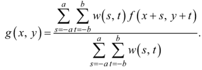

Такая реализация достаточно удобна и в применении, и в реализации. При подборе маски фильтра нет необходимости следить за тем, чтобы сумма коэффициентов равнялась единице, нормировка коэффициентов происходит автоматически.

Помимо линейных сглаживающих фильтров широко применяются порядковые фильтры, или фильтры на основе порядковых статистик. Схема применения таких фильтров включает 2 этапа. На первом этапе все значения интенсивности из окрестности рассматриваемой точки упорядочиваются (ранжируются). А на втором этапе в качестве отклика фильтра выбирается значение, стоящее на определенном месте в полученной последовательности. Наиболее широко распространен медианный фильтр, для которого в качестве отклика выбирается медиана, т. е. центральный элемент последовательности.

Такие фильтры являются крайне эффективными в борьбе с определенными видами шумов. В частности, медианный фильтр позволяет эффективно бороться с импульсным шумом, который также называется «соль и перец». Такой шум представляет собой наложение на изображение случайных черных и белых точек. Достаточно очевидно, что максимальное (белое) и минимальное (черное) допустимое значение интенсивности может оказаться медианным значением окрестности только в том случае, если в эту окрестность попадает достаточно большой белый или черный участок изображения, а в этом случае вероятность того, что эта точка является шумом, достаточно невелика. Во всех остальных случаях импульсный шум отсеивается практически полностью, а расфокусировка изображения значительно менее заметна, чем при применении усредняющих фильтров.

В ряде случаев применяются порядковые фильтры, отличные от медианных. Примерами могут служить максимизирующие или минимизирующие фильтры, т. е. фильтры, откликом которых является максимальное или минимальное значение по окрестности.

## 7. Пространственные фильтры повышения резкости

Другой важной задачей улучшения изображений является задача повышения резкости. 
Повышение резкости изображений позволяет подчеркнуть мелкие детали и контуры 
объектов, сделать изображение более четким и удобным для восприятия.

Операция повышения резкости изображений противоположна задаче расфокусировки, и логично предположить, что для ее решения можно применить противоположный функционал. Усреднение, применяемое в сглаживающих фильтрах, аналогично интегрированию, поэтому для повышения резкости применяются операции, аналогичные дифференцированию.

## 8. Основы фильтрации в частотной области

Процедура фильтрации в частотной области проста и состоит из следующих шагов:

1. Исходное изображение умножается на (-1) i + k, чтобы его фурье- преобразование оказалось центрированным;
2. Вычисляется прямое ДПФ fu,v изображения, полученного после первого шага;
3. Функция fu,v умножается на функцию фильтра hu, v;
4. Вычисляется обратное ДПФ от результата шага 3;
5. Выделяется вещественная часть результата шага 4;
6. Результат шага 5 умножается на (-1) i + k

Фильтр hu,v подавляет некоторые частоты преобразования, оставляя при этом другие без изменения.

Фурье-образ выходного изображения определяется выражением 
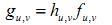

Умножение функций двух переменных h и f осуществляется поэлементно. В общем случае компоненты фильтра h являются комплексными величинами. В случае, если компоненты фильтра содержат только действительные величины, то действительная, и мнимая части функции f умножаются на одну и ту же действительную функцию фильтра h. Такие фильтры называются фильтрами нулевого фазового сдвига.

Фильтрованное изображение получается вычислением обратного преобразования Фурье от фурье-образа gu,v.

После применения низкочастотной фильтрации, изображение, по сравнению с исходным, содержит меньше резких деталей, поскольку высокие частоты подавлены. Аналогично, после применения высокочастотной фильтрации, на изображении уменьшаются изменения яркости в пределах больших гладких областей и выделяются переходные зоны быстрого изменения яркости (т.е. контуры). Такое изображение выглядит более резким.

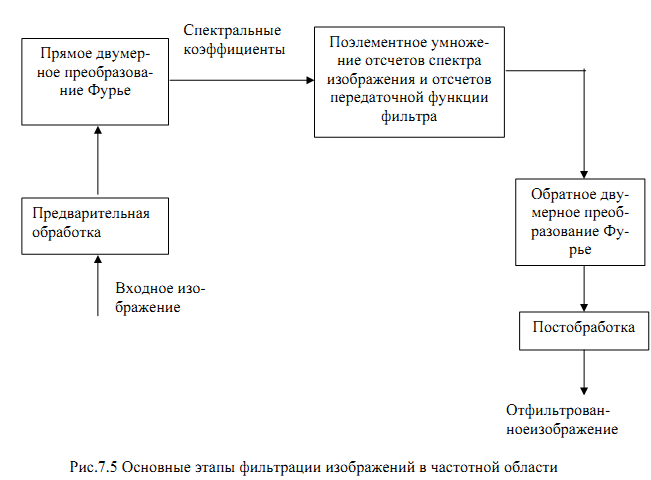

## 9. Частотные фильтры сглаживания изображения

Как отмечалось ранее, контуры и другие резкие перепады яркости на изображении,
включая шумы, вносят значительный вклад в высокочастотные составляющие его Фурье-
преобразования. Сглаживание изображения в частотной области достигается путем ослабления
высокочастотных компонент определенного диапазона Фурье-образа данного изображения.
Модель фильтрации изображения в частотной области в обобщенном виде может быть
описана следующим равенством:

G(u,v) = H(u,v) F(u,v),

где F(u, v) - Фурье-образ изображения, которое подлежит операции фильтрации, H(u, v) -
передаточная функция фильтра, которая ослабит высокочастотные компоненты F(u, v) и сфор-
мирует функцию G(u, v).

Рассмотрим три вида низкочастотных фильтров: идеальный фильтр, фильтр Баттерворта
и гауссов фильтр. Указанные фильтры по виду передаточной функции покрывают диапазон от
очень резких фильтров (идеальный фильтр) до очень гладких фильтров (гауссов фильтр).
Фильтр Баттерворта является единственным из рассматриваемых, который характеризуется 
порядком фильтра - параметром, определяющим крутизну передаточной функции фильтра.

При малых значениях порядка фильтра передаточная функция имеет гладкую форму, близкую
по форме к передаточной характеристике гауссова фильтра; при высоких значениях фильтр 
характеризуется крутой передаточной функцией и приближается по форме к характеристикам
идеального фильтра.

Идеальный фильтр низких частот представляют собой такой низкочастотный фильтр, который 
обрезает все высокочастотные составляющие Фурье-образа, находящиеся на большем расстоянии 
от начала координат центрированного изображения, чем некоторое заданное расстояние D0. 
Такой тип фильтра еще называется двумерным идеальным низкочастотным фильтром.

## 10. Повышения резкости изображений частотными фильтрами

Контуры и другие скачкообразные изменения яркости на изображении связаны с высокочастотными 
составляющими Фурье-преобразования изображения. Повышение резкости изображения может быть 
достигнуто в частотной области при помощи процедуры высокочастотной фильтрации, которая 
подавляет низкочастотные составляющие и не затрагивает высокочастотную часть 
Фурье-преобразования.

Передаточная функция высокочастотных фильтров может быть получена при помощи следующего соотношения:

Hhp(u, v)=1-Hlp(u, v),

где Hlp(u, v) – передаточная функция соответствующего низкочастотного фильтра.
Рассмотрим следующие виды высокочастотных фильтров: идеальные высокочастотные
фильтры, высокочастотные фильтры Баттерворта и гауссовы высокочастотные фильтры.
Идеальные фильтры высоких астот.

По аналогии с идеальными низкочастотными фильтрами идеальные высокочастотные
фильтры также почти не имеют реального практического применения.
Фильтры высоких астот Баттерворта. 

## 11. Избирательная фильтрация

## 12. Модель процесса искажения/восстановления изображения

## 13. Модели шума. Пространственные и частотные свойства шума

## 14. Подавление периодического шума с помощью частотной фильтрации

## 15. Подавление шумов методами пространственной фильтрации

## 16. Цветовая модель RGB

### Цветовые модели

В цветовой модели (пространстве) каждому цвету можно поставить в соответствие строго 
определенную точку. В этом случае цветовая модель – это просто упрощенное геометрическое 
представление, основанное на системе координатных осей и принятого масштаба.

Основные цветовые модели:

- RGB;
- CMY (Cyan Magenta Yellow);
- CMYK (Cyan Magenta Yellow Key, причем Key означает черный цвет);
- HSB;
- Lab;
- HSV (Hue, Saturation, Value);
- HLS (Hue, Lightness, Saturation);
- и другие.

В цифровых технологиях используются, как минимум, четыре основных модели: RGB,
CMYK, HSB в различных вариантах и Lab. В полиграфии используются также многочисленные
библиотеки плашечных цветов.

Цвета одной модели являются дополнительными к цветам другой модели. 
Дополнительный цвет – цвет, дополняющий данный до белого. Дополнительный для красного – 
голубой (зеленый+синий), дополнительный для зеленого – пурпурный (красный+синий), 
дополнительный для синего – желтый (красный+зеленый) и т.д.

По принципу действия перечисленные цветовые модели можно условно разбить на три
класса:

- аддитивные (RGB), основанные на сложении цветов;
- субтрактивные (CMY, CMYK), основу которых составляет операция вычитания
цветов (субтрактивный синтез);
- перцепционные (HSB, HLS, LAB, YCC), базирующиеся на восприятии.

Таким образом, цветовые модели (цветовое пространство) представляют средства для
концептуального и количественного описания цвета. 
> **_Цветовой режим_** – это способ реализации
определенной цветовой модели в рамках конкретной графической программы.

В большинстве цветовых моделей для описания цвета используется трехмерная система
координат. Она образует цветовое пространство, в котором цвет можно представить в виде 
точки с тремя координатами. Для оперирования цветом в трехмерном пространстве Т. Грассман
вывел три закона (1853г):

1. Цвет трехмерен – для его описания необходимы три компоненты. Любые четыре цвета
находятся в линейной зависимости, хотя существует неограниченное число линейно независи-
мых совокупностей из трех цветов.

Первый закон можно трактовать и в более широком смысле, а именно, в смысле трех-
мерности цвета. Необязательно для описания цвета применять смесь других цветов, можно ис-
пользовать и другие величины – но их обязательно должно быть три.

2. Если в смеси трех цветовых компонент одна меняется непрерывно, в то время, как две
другие остаются постоянными, цвет смеси также изменяется непрерывно.
3. Цвет смеси зависит только от цветов смешиваемых компонент и не зависит от их
спектральных составов.
Смысл третьего закона становится более понятным, если учесть, что один и тот же цвет
(в том числе и цвет смешиваемых компонент) может быть получен различными способами. На-
пример, смешиваемая компонента может быть получена, в свою очередь, смешиванием других
компонент

### RGB

Это одна из наиболее распространенных и часто используемых моделей. Она применяется в 
приборах, излучающих свет, таких, например, как мониторы, прожекторы, фильтры и другие 
подобные устройства, а также в устройствах ввода графической информации – сканерах, 
цифровых камерах.

Данная цветовая модель базируется на трех основных цветах: Red – красном, Green – зеленом 
и Blue – синем. Каждая из вышеперечисленных составляющих может варьироваться в пределах 
от 0 до 255, образовывая разные цвета и обеспечивая, таким образом, доступ ко всем
16 миллионам.

Эта модель аддитивная. Слово аддитивная (сложение) подчеркивает, что цвет получается 
при сложении точек трех базовых цветов, каждая своей яркости. Эти тройки базовых точек
(светящиеся точки) расположены очень близко друг к другу, так что каждая тройка сливается
для нас в большую точку определенного цвета. Чем ярче цветная точка (красная, зеленая, синяя), 
тем большее количество этого цвета добавится к результирующей (тройной) точке.

Аддитивный цвет получается на основе законов Грассмана путем соединения лучей света разных
цветов. В основе этого явления лежит тот факт, что большинство цветов видимого
спектра могут быть получены путем смешивания в различных пропорциях трех основных 
цветовых компонент. Этими компонентами, которые в теории цвета иногда называются первичными 
цветами, являются красный (Red), зеленый (Green) и синий (Вlue) цвета. При попарном
смешивании первичных цветов образуются вторичные цвета: голубой (Сyan), пурпурный (Magenta) 
и желтый (Yellow). Следует отметить, что первичные и вторичные цвета относятся к базовым цветам.

>Базовыми цветами называют цвета, с помощью которых можно получить практически весь спектр видимых цветов.

Для получения новых цветов с помощью аддитивного синтеза можно использовать и
различные комбинации из двух основных цветов, варьирование состава которых приводит к
изменению результирующего цвета.

1. Значения некоторых цветов в модели RGB

| Цвет | R | G | B |
| --- | --- | --- | --- |
| Красный  (red) | 255 | 0 | 0 |
| Зеленый (green) | 0 | 255 | 0 |
| Синий (blue) | 0 | 0 | 255 |
| Фуксин (magenta) | 255 | 0 | 255 |
| Голубой (cyan) | 0 | 255 | 255 |
| Желтый (yellow) | 255 | 255 | 0 |
| Белый (white) | 255 | 255 | 255 |
| Черный (black) | 0 | 0 | 0 |

При увеличении яркости отдельных составляющих будет увеличиваться и яркость 
результирующего цвета: если смешать все три цвета с максимальной интенсивностью, 
то результатом будет белый цвет; напротив, при отсутствии всех цветов получается черный.

Модель является аппаратно–зависимой, так как значения базовых цветов (а также точка
белого) определяются качеством примененного в мониторе люминофора. В результате 
на разных мониторах одно и то же изображение выглядит неодинаково.

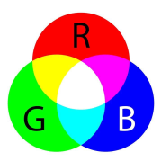

_Рис. 1. Схема образования цветов в модели RGB_

Система координат RGB – куб с началом отсчета (0,0,0), соответствующим черному цвету. 
Максимальное значение RGB – (255,255,255) соответствует белому цвету.

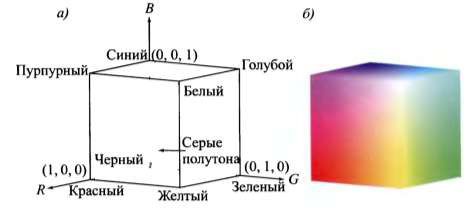

Рис. 2. Схема модели RGB: а) схема цветового куба модели RGB, б) цветовой куб

На рис. 2 видны первичные и вторичные вершины цветов яркости. Точки на главной
диагонали имеют оттенки серого цвета от черного в начале координат до белого в точке 1,1,1).
Несомненными достоинствами данного режима является то, что он позволяет работать
со всеми 16 миллионами цветов, а недостаток состоит в том, что при выводе изображения на
печать часть из этих цветов теряется, в основном самые яркие и насыщенные, также возникает
проблема с синими цветами.

## 17. Цветовые модели CMY и CMYK

### CMY

В этой модели основные цвета образуются путем вычитания из белого цветов основных 
аддитивных цветов модели RGB.

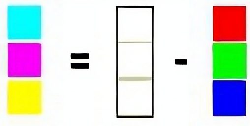

_Рис. 1. Получение модели CMY из RGB_

>Цвета, использующие белый свет, вычитая из него определенные участки спектра, 
называются субтрактивными. 

Основные цвета этой модели: 
- голубой (белый минус красный)
- фуксин (в некоторых книгах его называют пурпурным) (белый минус зеленый)
- желтый (белыйминус синий). 

Эти цвета являются полиграфической триадой и могут быть легко воспроизведе-
ны полиграфическими машинами. При смешении двух субтрактивных цветов результат затем-
няется (в модели RGB было наоборот). При нулевом значении всех компонент образуется бе-
лый цвет (белая бумага). Эта модель представляет отраженный цвет, и ее называют моделью
субтрактивных основных цветов. Данная модель является основной для полиграфии и также
является аппаратно–зависимой.

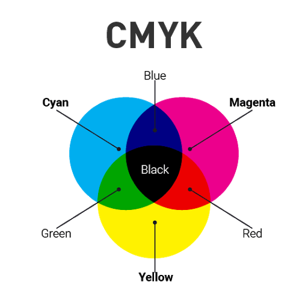

_Рис. 2. Схема образования цветов в модели CMY_

Система координат CMY – тот же куб, что и для RGB, но с началом отсчета в точке с
RGB координатами (255,255,255), соответствующей белому цвету. Цветовой куб модели CMY
показан на рис. 3.

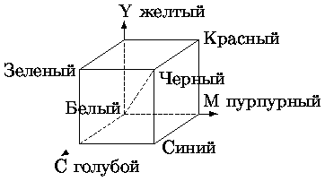

_Рис. 3. Цветовой куб модели CMY_

### CMYK

Цветовая модель CMYK еще одна из наиболее часто используемых цветовых моделей,
нашедших широкое применение. Она является субтрактивной моделью.

Модель CMYK (Cyan Magenta Yellow Key, причем Key означает черный цвет) – является
дальнейшим улучшением модели CMY и уже четырехканальная. Поскольку реальные 
типографские краски имеют примеси, их цвет не совпадает в точности с теоретически рассчитанным
голубым, желтым и пурпурным. Особенно трудно получить из этих красок черный цвет. 
Поэтому в модели CMYK к триаде добавляют черный цвет. Модель CMYK является «эмпирической», 
в отличие от теоретических моделей CMY и RGB. Модель является аппаратнозависимой.

В отличие от аддитивной модели, где отсутствие цветовых составляющих образует черный цвет, 
в субтрактивной все наоборот: если нет отдельных компонентов, то цвет белый, если они все 
присутствуют, то образуется грязно–коричневый, который делается более темным при добавлении 
черной краски, которая используется для затемнения и других получаемых цветов.

Ясно, что цвет в CMYK зависит не только от спектральных характеристик красителей и
от способа их нанесения, но и их количества, характеристик бумаги и других факторов. 
Фактически цифры CMYK являются лишь набором аппаратных данных для фотонаборного автомата
и не определяют цвет однозначно.

Так, исторически в разных странах сложилось несколько стандартизованных процессов
офсетной печати. Сегодня это американский, европейский и японский стандарты для мелованной 
и немелованной бумаг. Именно для этих процессов разработаны стандартизованные бумаги
и краски. Для них же созданы соответствующие цветовые модели CMYK, которые используются 
в процессах цветоделения. Однако, многие типографии, в которых работают специалисты с
достаточной квалификацией, нередко создают профиль, описывающий печатный процесс конкретной 
печатной машины с конкретной бумагой. Этот профиль они предоставляют своим заказчикам.

Следует помнить, что если вы готовите изображение к печати, то следует все-таки работать 
с CMYK, потому что в противном случае то, что вы увидите на мониторе, и то, что получите 
на бумаге, будет отличаться настолько сильно, что вся работа может пойти насмарку.

Модель CMYK – это субтрактивная цветовая модель, которая описывает реальные красители, 
используемые в полиграфическом производстве.

## 18. Цветовая модель HSL и HSV

### Перцепционные цветовые модели

Для дизайнеров, художников и фотографов основным инструментом индикации и воспроизведения 
цвета служит глаз. Этот естественный «инструмент» обладает цветовым охватом, намного 
превышающим возможности любого технического устройства, будь то сканер, принтер или 
фотоэкспонирующее устройство вывода на пленку.

Как было показано ранее, используемые для описания технических устройств цветовые
системы RGВ и СМYК являются аппаратнозависимыми. Это значит, что воспроизводимый или
создаваемый с помощью них цвет определяется не только составляющими модели, но и зависит
от характеристик устройства вывода.

Для устранения аппаратной зависимости был разработан ряд так называемых перцепционных 
(иначе – интуитивных) цветовых моделей. В их основу заложено раздельное определение 
яркости и цветности. Такой подход обеспечивает ряд преимуществ:

- позволяет обращаться с цветом на интуитивно понятном уровне;
- значительно упрощает проблему согласования цветов, поскольку 
после установки значения яркости можно заняться настройкой цвета.

Прототипом всех цветовых моделей, использующих концепцию разделения яркости и цветности, 
является НSV–модель. К другим подобным системам относятся НSI, НSB, НSL и YUV. 
Общим для них является то, что цвет задается не в виде смеси трех основных цветов –
красного, синего и зеленого, а определяется путем указания двух компонентов: цветности 
(цветового тона и насыщенности) и яркости.

### Цветовая модель HSI

Здесь заглавные буквы символизируют тон (цвет), насыщенность и интенсивность 
(Hue Saturation Intensity). Предложена в 1978 году.

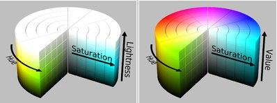

>Насыщенность (Saturation) – это параметр цвета, определяющий его чистоту. Отсутствие 
серых примесей (чистота кривой) соответствует данному параметру. Уменьшение насыщенности 
цвета означает его разбеливание. 

Цвет с уменьшением насыщенности становится пастельным,  блеклым, размытым. На модели все 
одинаково насыщенные цвета располагаются на концентрических окружностях, т. е. можно 
говорить об одинаковой насыщенности, например, зеленого и пурпурного цветов, и чем ближе 
к центру круга, тем все более разбеленные цвета получаются. В самом центре любой цвет 
максимально разбеливается, проще говоря, становится белым цветом.

Работу с насыщенностью можно характеризовать как добавление в спектральный цвет
определенного процента белой краски. Чем больше в цвете содержание белого, тем ниже значение 
насыщенности, тем более блеклым он становится. 

>Интенсивность (Intensity) – это параметр цвета, определяющий освещенность или затемненность 
цвета. Амплитуда (высота) световой волны соответствует этому параметру.

Уменьшение яркости цвета означает его зачернение. Работу с яркостью можно характеризовать
как добавление в спектральный цвет определенного процента черной краски. Чем больше в
цвете содержание черного, тем ниже яркость, тем более темным становится цвет.

Пространство HSI состоит из вертикальной оси интенсивности и цветных точек, которые
располагаются на плоскости, перпендикулярной этой оси. При перемещении этой плоскости
вверх и вниз вдоль оси ее пересечение с цветовым кубом имеет форму треугольника или 
шестиугольника. Это легче себе представить, если смотреть на куб сверху вдоль оси 
интенсивности. На этом рисунке видно, что оси первичных цветов разделены углами в 120°. 
Оси вторичных цветов расположены под углом 60° к первичным. Это означает, что вторичные 
цвета также расположены под углом 120° друг к другу.

## 19. Цветовые преобразования

## 20. Основы сжатия изображений

Упрощённо, изображение представляют собой таблицу, в ячейках которой хранятся цвета каждого пикселя. Если мы работаем с чёрно-белым (или, точнее, серым) изображением, то вместо цвета в ячейки помещают значения яркости из отрезка [0,1]. При этом 0 соответствует чёрному цвету, 1 — белому. Но с дробями работать неудобно, поэтому часто значения яркости берут целыми из диапазона от 0 до 255. Тогда каждое значение будет занимать ровно 1 байт.

Даже небольшие изображения требуют много памяти для хранения. Так, если мы кодируем яркость каждого пикселя одним байтом, то изображение одного кадра формата FullHD (1920×1080) займёт почти два мегабайта. Представьте, сколько памяти потребуется для хранения полуторачасового фильма!

Поэтому изображения стремятся сжать. То есть закодировать таким образом, чтобы памяти для хранения требовалось меньше. А во время просмотра мы декодируем записанные в память данные и получаем исходный кадр. Но это лишь в идеале.

Существует много алгоритмов сжатия данных. О их количестве можно судить по форматам, поддерживаемым современными архиваторами: ZIP, 7zip, RAR, gzip, bzip2 и так далее. Неудивительно, что благодаря активной работе учёных и программистов в настоящее время степень сжатия данных вплотную подошла к теоретическому пределу.

Плохая новость в том, что для изображения этот теоретический предел не так уж и велик. Попробуйте сохранить фотографию (особенно с большим количеством мелких деталей) в формате PNG — размер получившегося файла может вас расстроить.

Это происходит из-за того, что в изображениях из реального мира (фотографиях, например) значения яркости редко бывают одинаковыми даже у соседних пикселей. Всегда есть мельчайшие колебания, которые неуловимы человеческим глазом, но которые алгоритм сжатия честно пытается учесть.

Алгоритмы сжатия «любят», когда в данных есть закономерность. Лучше всего сжимаются длинные последовательности нулей (закономерность тут очевидна). В самом деле, вместо того, чтобы записывать в память 100 нулей, можно записать просто число 100 (конечно, с пометкой, что это именно количество нулей). Декодирующая программа «поймёт», что имелись в виду нули и воспроизведёт их.

Однако если в нашей последовательности в середине вдруг окажется единица, то одним числом 100 ограничится не удастся.

Но зачем кодировать абсолютно все детали? Ведь когда мы смотрим на фотографию, нам важен общий рисунок, а незначительные колебания яркости мы и не заметим. А значит, при кодировании мы можем немного изменить изображение так, чтобы оно хорошо кодировалось. При этом степень сжатия сразу вырастет. Правда, декодированное изображение будет незначительно отличаться от исходного, но кто заметит?

## 21. Использование вейвлетов при сжатии изображений

<https://velikodniy.github.io/2019/01/31/wavelets-theory/>

## 22. Основы морфологической обработки изображений

## 23. Основные морфологические алгоритмы обработки изображений

## 24. Основы сегментации изображений

## 25. Пороговая обработка изображений

## 26. Представление изображений

## 27. Распознавание объектов. Образы и классы образов

## 28. Распознавание объектов на основе методов теории принятия решений

## 29. Распознавание объектов на основе структурных методов

## 30. Структура и общие принципы функционирования систем технического зрения
